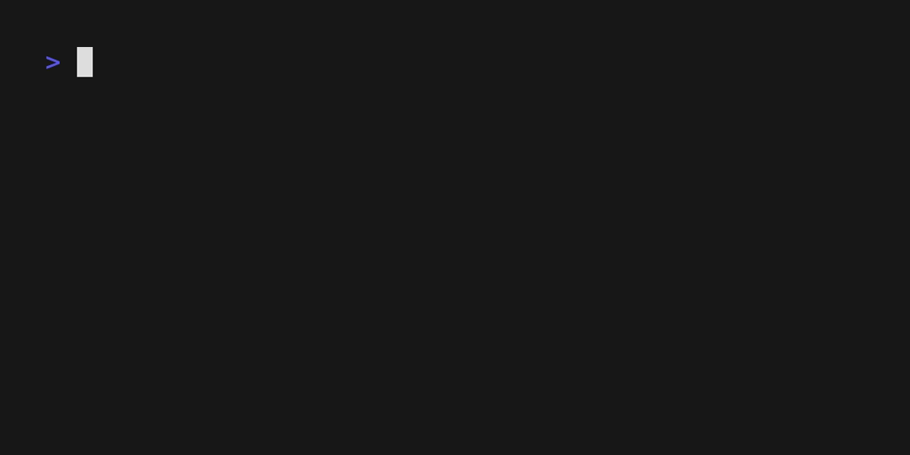

# L33tspeak Converter

A simple command-line tool written in Go that converts text into leetspeak (l33t speak).



## What is Leetspeak?

Leetspeak is an informal language or code that substitutes letters with numbers or symbols that look visually similar (e.g. `A` → `4`, `E` → `3`, `S` → `5`). [Learn more](https://en.wikipedia.org/wiki/Leet).

## Usage

```bash
go run main.go <word> [word2] ...
```

### Examples

```bash
go run main.go hello
# Output: #3110

go run main.go leetspeak
# Output: 13375p34k

go run main.go hello world
# Output: #3110 //0r1_d
```

## Character Map

| Letter | Leet |
|--------|------|
| A | 4 |
| B | 8 |
| C | ( |
| E | 3 |
| G | 6 |
| H | # |
| I | ! |
| J | _ |
| L | 1 |
| O | 0 |
| Q | 0_ |
| S | 5 |
| T | 7 |
| V | / |
| W | // |
| X | >< |
| Y | `/ |
| Z | 2 |

Letters not in the map are left unchanged.

## Build

```bash
go build
./leetspeak hello world
# Output: #3110 //0r1_d
```
